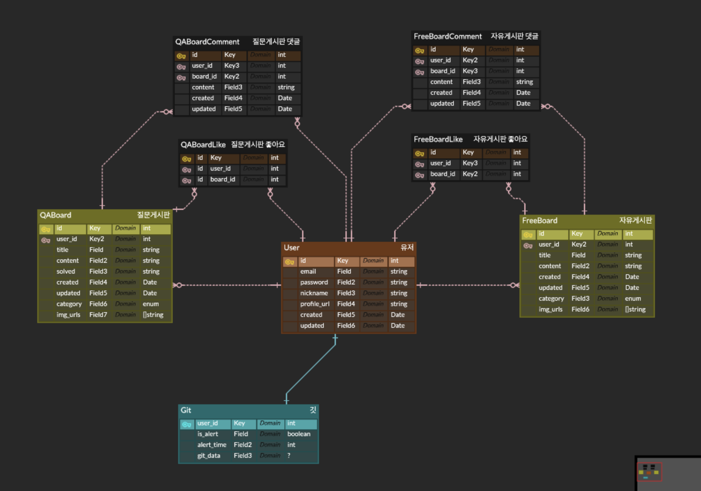

# nest 시작하기

`nest new nest-oauth`

# typeorm 설치

`npm install --save @nestjs/typeorm typeorm mysql2`

### app.module.ts 파일 설정

```js
imports: [
 TypeOrmModule.forRoot({
   type: 'mysql', // DB 종류
   host: 'localhost', // DB 서버 주소
   port: 3306, // DB 서버 포트
   username: 'root', // DB 접속 계정
   password: '1234', // DB 접속 비밀번호
   database: 'nest', // DB 스키마 이름
   entities: [User], // DB 테이블과 매핑될 클래스를 모아둔 배열
   synchronize: false, // 애플리케이션 실행 시점에 동기화 여부
 }),
],
```

# GraphQL

`npm install @nestjs/graphql apollo-server-express graphql-tools`

```js
query{
  getProducts{
    id, title, price
  }
  mutation{
    createProduct(
      data : {title:"Hi",price:10000}
    ){
      id,title,price
    }
  }
}
```

모델 생성

`$ nest generate module product`
`$ nest generate service product`
`$ nest generate resovle product`

# GraphQL

`npm i @nestjs/graphql apollo-server-express`

app.module.ts

`npm install --save @nestjs/graphql apollo-server-express graphql`


# ERD 




